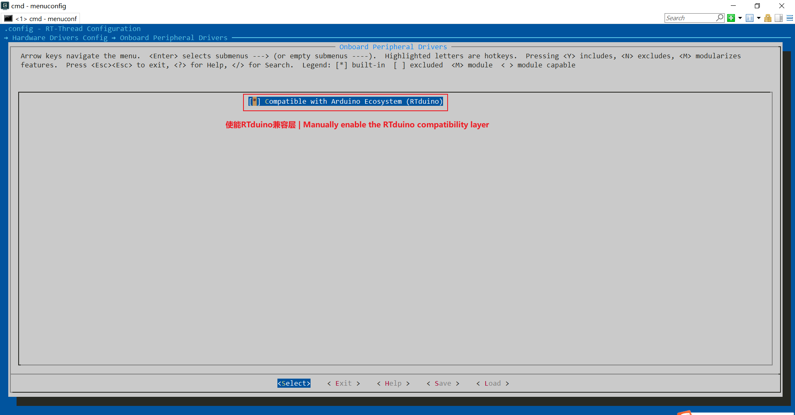

# BSP开发与板卡烧录

## 1 前章小结

通过前面几章的介绍，大家已经对如下内容有了一个大致的了解：

- 什么是RTduino/RT-Thread；
- 如何下载RT-Thread源码
- 如何搭建RTduino/RT-Thread编译环境，以及如何编辑代码；
- 什么是Env工具
- 如何使能并编译RTduino

本小节将带着大家把整个BSP编译、下载流程梳理一遍，假设您已经搭建好Env编译环境，并下载好RT-Thread源码。

## 2 已经支持RTduino的BSP

### 2.1 官方建议入门BSP

以下 BSP 由 RTduino/RT-Thread 官方支持，其功能得到官方验证，并配有详细入门资料，不会踩坑，建议初学者选择。**请在选择所需的对应BSP芯片厂商。**

<!-- tabs:start -->

## ** STM32 **

| BSP名称               | 仓库 & 概述                                                                                                                                                                                                                                      | [标准引脚布局](/zh/beginner/arduino-pinout) | DigitalWrite & Read | AnalogWrite / PWM | AnalogRead / ADC | 串口  | I2C | SPI |
| ------------------- | -------------------------------------------------------------------------------------------------------------------------------------------------------------------------------------------------------------------------------------------- | ------------------------------------- | ------------------- | ----------------- | ---------------- | --- | --- | --- |
| STM32F072 Nucleo    | [Github](https://github.com/RT-Thread/rt-thread/tree/master/bsp/stm32/stm32f072-st-nucleo/applications/arduino_pinout) / [Gitee](https://gitee.com/rtthread/rt-thread/tree/master/bsp/stm32/stm32f072-st-nucleo/applications/arduino_pinout) | √                                     | √                   | √                 | √                | √   | √   |     |
| STM32F401 Nucleo    | [Github](https://github.com/RT-Thread/rt-thread/tree/master/bsp/stm32/stm32f401-st-nucleo/applications/arduino_pinout) / [Gitee](https://gitee.com/rtthread/rt-thread/tree/master/bsp/stm32/stm32f401-st-nucleo/applications/arduino_pinout) | √                                     | √                   | √                 | √                | √   | √   | √   |
| STM32F410 Nucleo    | [Github](https://github.com/RT-Thread/rt-thread/tree/master/bsp/stm32/stm32f410-st-nucleo/applications/arduino_pinout) / [Gitee](https://gitee.com/rtthread/rt-thread/tree/master/bsp/stm32/stm32f410-st-nucleo)                             | √                                     | √                   | √                 | √                | √   | √   |     |
| STM32F411 Nucleo    | [Github](https://github.com/RT-Thread/rt-thread/tree/master/bsp/stm32/stm32f411-st-nucleo/applications/arduino_pinout) / [Gitee](https://gitee.com/rtthread/rt-thread/tree/master/bsp/stm32/stm32f411-st-nucleo)                             | √                                     | √                   | √                 | √                | √   | √   | √   |
| STM32F412 Nucleo    | [Github](https://github.com/RT-Thread/rt-thread/tree/master/bsp/stm32/stm32f412-st-nucleo/applications/arduino_pinout) / [Gitee](https://gitee.com/rtthread/rt-thread/tree/master/bsp/stm32/stm32f412-st-nucleo)                             | √                                     | √                   | √                 | √                | √   | √   |     |
| STM32L476 Nucleo    | [Github](https://github.com/RT-Thread/rt-thread/tree/master/bsp/stm32/stm32l476-st-nucleo/applications/arduino_pinout) / [Gitee](https://gitee.com/rtthread/rt-thread/tree/master/bsp/stm32/stm32l476-st-nucleo)                             | √                                     | √                   | √                 | √                | √   | √   | √   |
| STM32G474 Nucleo    | [Github](https://github.com/RT-Thread/rt-thread/tree/master/bsp/stm32/stm32g474-st-nucleo/applications/arduino_pinout) / [Gitee](https://gitee.com/rtthread/rt-thread/tree/master/bsp/stm32/stm32g474-st-nucleo)                             | √                                     | √                   | √                 | √                | √   | √   |     |
| STM32U575 Nucleo    | [Github](https://github.com/RT-Thread/rt-thread/tree/master/bsp/stm32/stm32u575-st-nucleo/applications/arduino_pinout) / [Gitee](https://gitee.com/rtthread/rt-thread/tree/master/bsp/stm32/stm32u575-st-nucleo)                             | √                                     | √                   | √                 | √                | √   | √   |     |
| STM32F469 Discovery | [Github](https://github.com/RT-Thread/rt-thread/tree/master/bsp/stm32/stm32f469-st-disco/applications/arduino_pinout) / [Gitee](https://gitee.com/rtthread/rt-thread/tree/master/bsp/stm32/stm32f469-st-disco)                               | √                                     | √                   | √                 | √                | √   | √   |     |
| STM32F103 BluePill  | [Github](https://github.com/RT-Thread/rt-thread/tree/master/bsp/stm32/stm32f103-blue-pill/applications/arduino_pinout) / [Gitee](https://gitee.com/rtthread/rt-thread/tree/master/bsp/stm32/stm32f103-blue-pill)                             | ×                                     | √                   | √                 | √                | √   | √   | √   |
| STM32F401 BlackPill | [Github](https://github.com/RT-Thread/rt-thread/tree/master/bsp/stm32/stm32f401-weact-blackpill/applications/arduino_pinout) / [Gitee](https://gitee.com/rtthread/rt-thread/tree/master/bsp/stm32/stm32f401-weact-blackpill)                 | ×                                     | √                   | √                 | √                | √   | √   | √   |
| STM32F411 BlackPill | [Github](https://github.com/RT-Thread/rt-thread/tree/master/bsp/stm32/stm32f411-weact-blackpill/applications/arduino_pinout) / [Gitee](https://gitee.com/rtthread/rt-thread/tree/master/bsp/stm32/stm32f411-weact-blackpill)                 | ×                                     | √                   | √                 | √                | √   | √   | √   |
| STM32L475潘多拉        | [Github](https://github.com/RT-Thread/rt-thread/tree/master/bsp/stm32/stm32l475-atk-pandora/applications/arduino_pinout) / [Gitee](https://gitee.com/rtthread/rt-thread/tree/master/bsp/stm32/stm32l475-atk-pandora)                         | ×                                     | √                   | √                 | √                | √   | √   | √   |
| STM32L431小熊派        | [Github](https://github.com/RT-Thread/rt-thread/tree/master/bsp/stm32/stm32l431-BearPi/applications/arduino_pinout) / [Gitee](https://gitee.com/rtthread/rt-thread/tree/master/bsp/stm32/stm32l431-BearPi)                                   | ×                                     | √                   | √                 | √                | √   | √   |     |

## ** Renesas 瑞萨 **

| BSP名称        | 仓库 & 概述                                                                                                                                                                                                                                    | [标准引脚布局](/zh/beginner/arduino-pinout) | DigitalWrite & Read | AnalogWrite / PWM | AnalogRead / ADC | 串口  | I2C | SPI |
| ------------ | ------------------------------------------------------------------------------------------------------------------------------------------------------------------------------------------------------------------------------------------ | ------------------------------------- | ------------------- | ----------------- | ---------------- | --- | --- | --- |
| 瑞萨 RA6M3 HMI | [Github](https://github.com/RT-Thread/rt-thread/tree/master/bsp/renesas/ra6m3-hmi-board/board/rtduino/arduino_pinout) / [Gitee](https://gitee.com/rtthread/rt-thread/tree/master/bsp/renesas/ra6m3-hmi-board/board/rtduino/arduino_pinout) | √                                     | √                   | √                 | √                | √   | √   |     |

## ** Raspberry Pi Pico **

| BSP名称             | 仓库 & 概述                                                                                                                                                                                                                | [标准引脚布局](/zh/beginner/arduino-pinout) | DigitalWrite & Read | AnalogWrite / PWM | AnalogRead / ADC | 串口  | I2C | SPI |
| ----------------- | ---------------------------------------------------------------------------------------------------------------------------------------------------------------------------------------------------------------------- | ------------------------------------- | ------------------- | ----------------- | ---------------- | --- | --- | --- |
| Raspberry Pi Pico | [Github](https://github.com/RT-Thread/rt-thread/tree/master/bsp/raspberry-pico/applications/arduino_pinout) / [Gitee](https://gitee.com/rtthread/rt-thread/tree/master/bsp/raspberry-pico/applications/arduino_pinout) | ×                                     | √                   | √                 | √                | √   | ×   | ×   |

<!-- tabs:end -->

### 2.2 社区适配BSP

以下 BSP 由 RTduino/RT-Thread 社区支持。**请在选择所需的对应BSP芯片厂商。**

<!-- tabs:start -->

## ** STM32 **

| BSP名称                                                                                                                                        | 资料  |
| -------------------------------------------------------------------------------------------------------------------------------------------- | --- |
| [大疆STM32F427 RoboMaster A板](https://github.com/RT-Thread/rt-thread/tree/master/bsp/stm32/stm32f427-robomaster-a/applications/arduino_pinout) |     |
| [大疆STM32F407 Robomaster C型](https://github.com/RT-Thread/rt-thread/tree/master/bsp/stm32/stm32f407-robomaster-c/applications/arduino_pinout) |     |

## ** NXP 恩智浦 **

| BSP名称                                                                                                                            | 资料  |
| -------------------------------------------------------------------------------------------------------------------------------- | --- |
| [NXP LPC55S69 EVK](https://github.com/RT-Thread/rt-thread/tree/master/bsp/lpc55sxx/lpc55s69_nxp_evk/applications/arduino_pinout) |     |

## ** CH32 **

| BSP名称                                                                                                                      | 资料  |
| -------------------------------------------------------------------------------------------------------------------------- | --- |
| [CH32V307V-R1](https://github.com/RT-Thread/rt-thread/tree/master/bsp/wch/risc-v/ch32v307v-r1/applications/arduino_pinout) |     |
| [CH32V208W-R0](https://github.com/RT-Thread/rt-thread/tree/master/bsp/wch/risc-v/ch32v208w-r0/applications/arduino_pinout) |     |

## ** 东软载波 **

| BSP名称                                                                                                              | 资料  |
| ------------------------------------------------------------------------------------------------------------------ | --- |
| [ES32F3696](https://github.com/RT-Thread/rt-thread/tree/master/bsp/essemi/es32f369x/applications/arduino_pinout)   |     |
| [ES32VF2264](https://github.com/RT-Thread/rt-thread/tree/master/bsp/essemi/es32vf2264/applications/arduino_pinout) |     |

<!-- tabs:end -->

## 3 使能RTduino

<!-- tabs:start -->

## ** Windows 10 **

本节默认使用者已经搭建好 Env 环境，如果你还没有搭建 Env 环境，请参照 [Env 编译环境搭建](/zh/beginner/env)章节，将 Env 工具在 Windows 10 下的环境搭建好。

这里以 `stm32f411-st-nucleo` BSP、Windows 10 操作系统环境为例，需要进入到 `rt-thread/bsp/stm32/stm32f411-st-nucleo` 文件夹下，按住 Shift 键+单击鼠标右键，点击**在此处打开 PowerShell 窗口**。

在 menuconfig 界面中，选择使能 RTduino：

```Kconfig
Hardware Drivers Config --->
    Onboard Peripheral Drivers --->
        [*] Compatible with Arduino Ecosystem (RTduino)
```



连续按 ESC 键，保存 (Yes) 并退出，此时 Env 工具会自动下载所需的软件包：


我们可以注意到在 BSP 根目录下生成了一个 packages 目录，并下载了我们所需的 RTduino 依赖库：


> ⚠️注意：
> 
> 1. 如果没有自动下载依赖的软件包，可以通过命令 `menuconfig -s`，选中 `Auto update pkgs config` （该操作只需要执行一次）。并重新进一次 `menuconfig` 并退出，即可自动下载所依赖的软件包。
> 
> ```Kconfig
> Env config --->
>     [*] Auto update pkgs config
>         Select download server (Auto)  --->
>     [ ] Auto create a Keil-MDK or IAR project
>     [ ] Send usage data for improve product
> ```
> 
> 2. 下载依赖软件包时，如果出现下载失败的问题，请检查是否开启了 VPN，VPN 会干扰软件包下载，请关闭 VPN。

## ** Ubuntu **

本节默认使用者已经搭建好 Env 环境，如果你还没有搭建 Env 环境，请参照 [Env 编译环境搭建](/zh/beginner/env)章节，将 Env 工具在 Ubuntu 下的环境搭建好。

<!-- tabs:end -->

## 4 编译BSP

在软件包均下载完毕之后，即可通过 `scons -j12` 命令来编译工程（12表示12个 CPU 核心并行编译，数字根据电脑硬件实际情况填写）。


## 5 将程序烧录到板卡

**请在选择所需的对应BSP芯片厂商。**

<!-- tabs:start -->

## ** STM32 (Windows 10) **

编译后，会在 BSP 文件夹的根目录下生成 `rtthread.bin` 文件，该文件即为要烧入到板卡的二进制文件。

下载 [STM32CubeProgrammer](https://www.stmcu.com.cn/ecosystem/Cube/STM32CubeProg) 软件，该软件用于将 bin 文件下载到 STM32 板卡中。[下载地址](https://www.stmcu.com.cn/Designresource/detail/software/709549)。

安装后，将 STM32 F411 Nucleo 板通过 USB 线插到计算机上。

打开 STM32CubeProgrammer 软件并点击 **Connect 按钮**：


将 bin 文件**拖入**到 STM32CubeProgrammer 界面内并点击 **Download 按钮**，即可完成程序烧录：


至此，你的 RTduino 程序就在板卡上运行起来了！

## ** Renesas 瑞萨 (Windows 10) **

## ** Raspberry Pi Pico (Ubuntu) **

<!-- tabs:end -->
