# 星火一号适配RTduino

## 前言

自从推出以来，RTduino 受到了广泛的关注和欢迎。这主要归功于 Arduino 社区库的强大和完善，这使得新手可以轻松上手。RTduino 的出现为我们带来了便利，使我们能够将 Arduino 的代码直接应用于其他硬件平台上。尽管如此，有时我们可能会面临一些挑战，比如想在自己设计的板子上使用 RTduino，或者可能某些特定的开发板尚未被 RTduino 支持。因此，今天我将以 STM32F407（星火一号）开发板为例（考虑到市面上 STM32 的开发者较多，其他芯片的开发者也可以参照这个步骤），分享如何配置自己的 BSP（Board Support Package）。

## 前期准备

1. 下载一个[CubeMX](https://www.st.com/zh/development-tools/stm32cubemx.html#get-software)（其他芯片的可以下载相应厂商的一个引脚配置软件）。

2. 下载 [RT-Thread](https://github.com/RT-Thread/rt-thread) 源码，里面有我们需要的驱动库。

3. 找到相应的 BSP ，我这里使用的是星火一号，所以我的路径是 `{文件路径}\rt-thread\bsp\stm32\stm32f407-rt-spark`（如果没有相应 BSP 的同学可以参照一下[文档中心](https://www.rt-thread.org/document/site/#/rt-thread-version/rt-thread-standard/tutorial/make-bsp/stm32-bsp/STM32%E7%B3%BB%E5%88%97BSP%E5%88%B6%E4%BD%9C%E6%95%99%E7%A8%8B)先配置一个自己的BSP）。

3. 下载[ENV](https://www.rt-thread.org/download.html#download-rt-thread-env-tool)环境用于调试，搭建好[ENV环境](https://www.rt-thread.org/document/site/#/development-tools/env/env)。

4. 做一个相应的引脚规划，星火一号上引出来的40Pin是对接树莓派的，所以我们就按照树莓派的接口进行配置。引脚规划的时候不需要刻意对应，按照自己的想法去安排就好了，但是有些是使用到硬件功能的就需要找到支持对应功能的引脚，比如ADC、PWM等。

   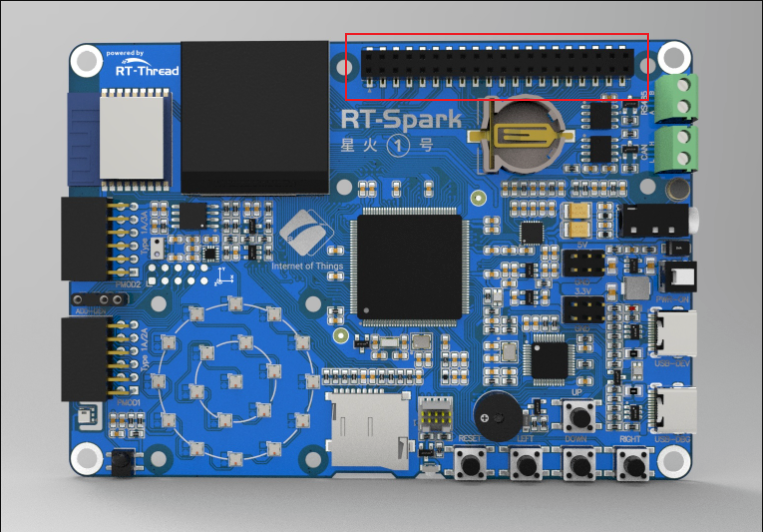
   
   | 引脚 | 功能  | 功能         | 引脚 |
   | ---- | ----- | ------------ | ---- |
   | 地   | /     | TIM1_CH2     | PE11 |
   | PE12 | GPIO  | TIM1_CH3     | PE13 |
   | PE14 | GPIO  | GPIO         | PE15 |
   | PD8  | GPIO  | /            | 地   |
   | PD10 | GPIO  | GPIO         | PD9  |
   | PF15 | GPIO  | /            | 地   |
   | PD7  | SDA.4 | SCL.4        | PG7  |
   | 地   | /     | GPIO(SPI_CS) | PG6  |
   | PG5  | SCK   | GPIO         | PG4  |
   | PG3  | MISO  | GPIO         | PG2  |
   | PG1  | MOSI  | /            | 地   |
   | 3.3V | /     | GPIO         | PB2  |
   | PB15 | GPIO  | GPIO         | PG0  |
   | PB14 | GPIO  | /            | 地   |
   | PA1  | GPIO  | GPIO         | PA0  |
   | 地   | /     | UART2_RX     | PA3  |
   | PA8  | GPIO  | UART2_TX     | PA2  |
   | PB6  | SCL.5 | /            | 地   |
   | PB7  | SDA.5 | /            | 5V   |
   | 3.3V | /     | /            | 5V   |
   
   这里做了一些小调整，我把 PE11，PE13分配到了PWM1，然后PG5，PG3，PG1是挂载在 RTT 软件SPI 总线上的。
   
   汇总的配置如下，有一些是使用了板子上的PMOD接口（如果你不使用DAC的话，可以省下一个PMOD接口）：
   
   - SOFT-SPI: 
   
     | SCK  | PG5  |
     | ---- | ---- |
     | MOSI | PG1  |
     | MISO | PG3  |
     | CS   | PG6  |
   
   - HARD-SPI：
     
     | SCK  | PA5  |
     | ---- | ---- |
     | MOSI | PA6  |
     | MISO | PA7  |
     | CS   | PG6  |
     
   - IIC：
     
     | I2C4 SCL | PG7  |
     | -------- | ---- |
     | I2C4 SDA | PD7  |
     | I2C5 SCL | PB6  |
     | I2C5 SDA | PB7  |
     
     （为什么编号使用4和5呢，因为原来的配置上已经存在I2C1、I2C2、I2C3了，有些板载资源是挂在这些总线上的，我们删除以后可能会造成某些板载无法使用，后面会详细讲述）
     
   - UART: 
   
     | UART1_RX | PA10 |
     | -------- | ---- |
     | UART1_TX | PA9  |
     | UART2_RX | PA3  |
     | UART2_TX | PA2  |
   
     （UART1也为控制台串口）
   
   - ADC：
   
     | ADC3_IN4  | PF6  |
     | --------- | ---- |
     | ADC3_IN5  | PF7  |
     | ADC3_IN14 | PF4  |
     | ADC3_IN15 | PF5  |
     | DAC_OUT1  | PA4  |
   
   - PWM: 
   
     | TIM1_CH2 | PE11 |
     | -------- | ---- |
     | TIM1_CH3 | PE13 |
     | TIM2_CH3 | PB10 |
     | TIM2_CH4 | B11  |
     | TIM4_CH1 | PD12 |
   
   另外就是一些板载资源的一些引脚，我这里只做了Buzzer、按键、LED灯：
   
   | Buzzer    | PB0  |
   | --------- | ---- |
   | R-LED     | PF12 |
   | B-LED     | PF11 |
   | KEY_UP    | PC5  |
   | KEY_DOWM  | PC1  |
   | KEY_LEFT  | PC4  |
   | KEY_RIGHT | PC0  |
   
   
   
5. 下载[pinout-generator](https://github.com/RTduino/pinout-generator)工具帮助我们快速生成引脚图代码。

## 配置

### CubeMX配置

1. 首先就是打开`C:\Users\RTT\Desktop\RTT\rt-thread\bsp\stm32\stm32f407-rt-spark\board\CubeMX_Config`路径下的`CubeMX_Config.ioc`文件，他会将之前配置好的引脚信息在CubeMX中打开。

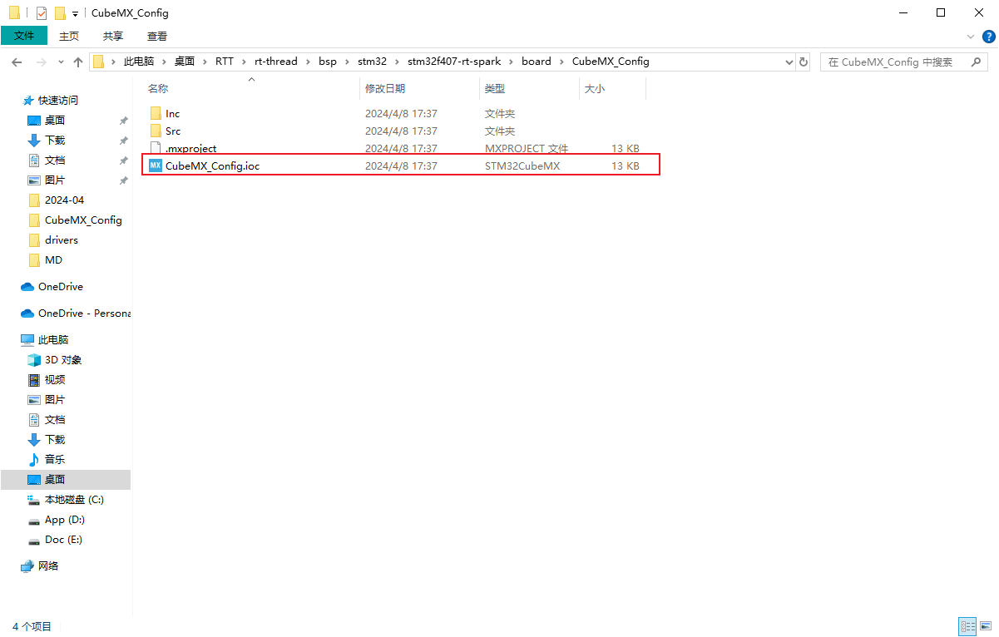

2. 打开后我们按照上面所定义的引脚去进行相应的设置就好了（这里注意，`GPIO`、`软件I2C`跟`软件SPI`（本质上也还是使用GPIO去模拟）的对应引脚是不需要配置的，我们使用的时候RTT会帮我们设置好吗，让它保持灰色就好）。这里我们需要配置的只有`UART`、`PWM`、`ADC`。

   1. 配置PWM的时候需要留意始终是否开启，通道功能是否为产生PWM波，以及通道引脚跟之前规划的是否一致。

      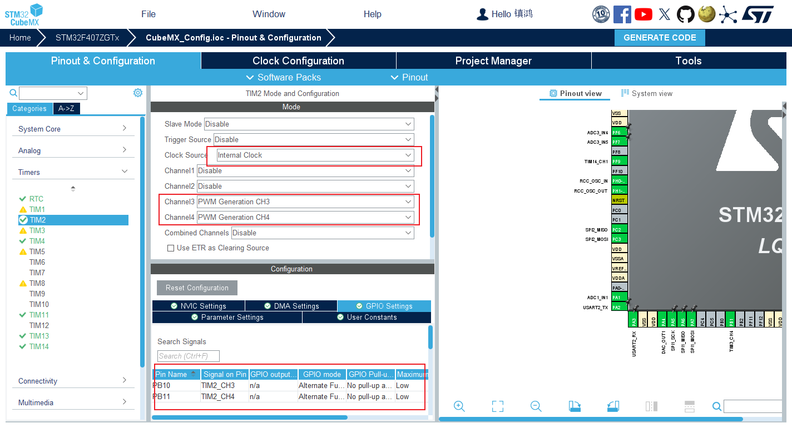

   1. 配置串口的时候要注意把这个异步开关给打开，不然默认是Disable，引脚是黄色的，这时候串口还没法正常使用。
   
      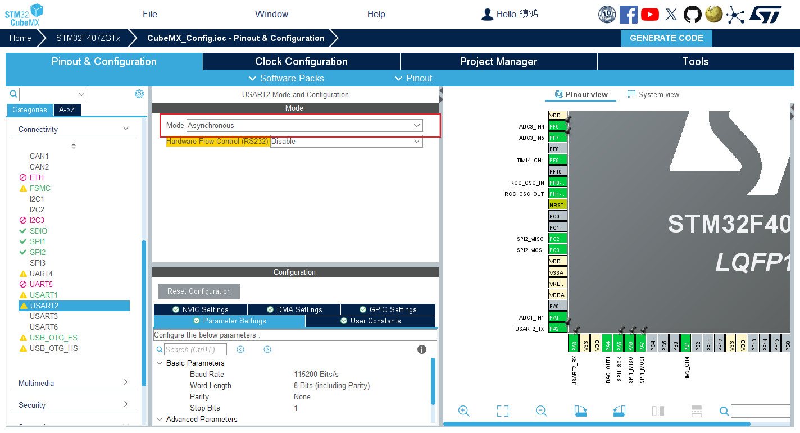
   
   1. 配置ADC的话就直接选择引脚然后选择相应的ADC通道就好了，一般这里不会有什么问题。
   
   1. 配置完成后我们检查一下左边的这个示意图，确认需要使用的引脚已经全部为绿色，就可以点击右上角的`GENERATE CODE`按钮生成相应的代码了
   
      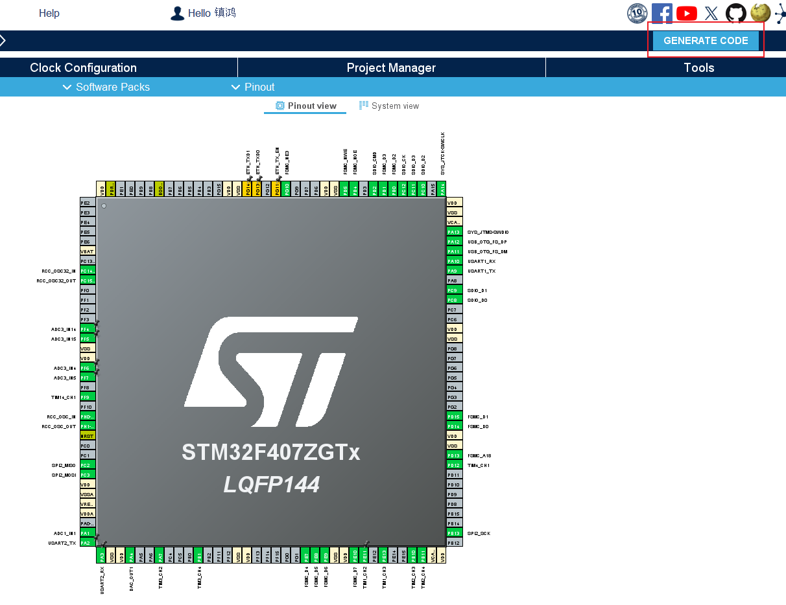
   
3. 我们回到刚刚的文件目录下，会发现此时会多出一些文件，此时我们需要删除一些使用不上的。

   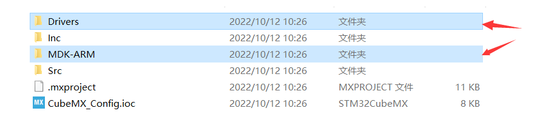

   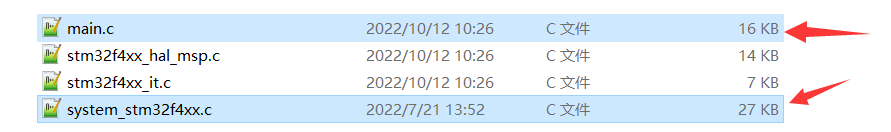

### pinout-generator配置

2. 然后我们在打开`pinout-generator`软件来配置相应的一个引脚。

   1. 首先是将芯片选择为STM32并且填写相应的工程与板子名称，然后工程路径选择到板子文件里的一个`applications`文件夹，待会生成的代码就会保存在里面了。**最重要的一点！**完成操作后记得<u>保存配置</u>

      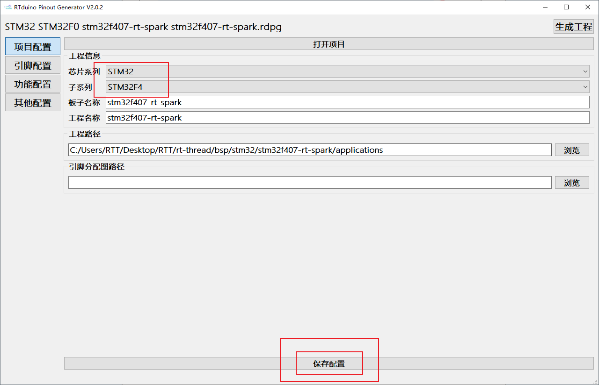

   2. 然后就是到引脚配置这里，右击鼠标就能够选择相应的功能，例如添加引脚、修改引脚等。将我们刚刚配置好的引脚填写进去。注意，Arduino中，D3、D6、D9、D10、D11为PWM引脚，所以我们在排引脚编号的时候最好将这几个安排给我们规划好的PWM引脚。D0、D1给到一个串口引脚。其他引脚就可以按照个人需求来安排就好了。（这个只是辅助我们去快速生成代码，到后面我们想修改的时候直接操作代码就行）

      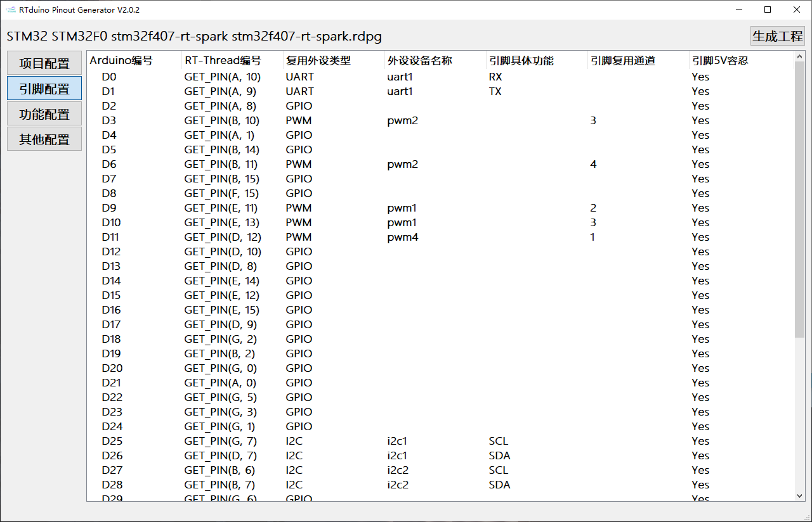

   3. 接着到功能配置，如果你有使用到第二个串口的话就把第一个选项勾上。其他选项按照自己选择的配置好的来就行了。例如我这里SPI是软件模拟的，无需配置。然后i2C设备这里只能选择上面填写了的i2c1或者i2c2，跟我们上面说编号为i2c4、i2c5不合，这个我们等会进到代码里面修改就行，SPI的片选信号可以根据自己需求选一个GPIO口。

      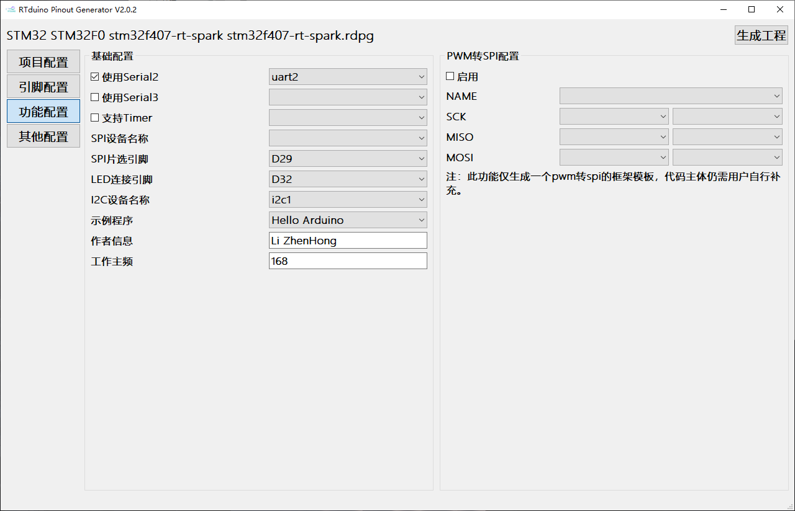

   4. 把这些填写完成后我们就可以点击右上角的`生成工程`就行了。

   5. 这时候会在刚刚选择的工程路径下生成4个新文件。
      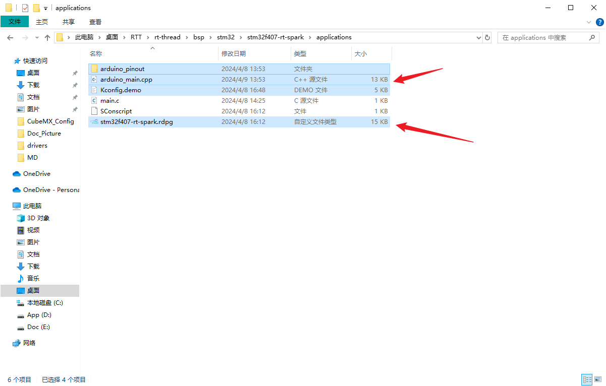

      | 文件名称                | 作用                                                         |
      | ----------------------- | ------------------------------------------------------------ |
      | arduino_pinout          | 存放引脚配置信息                                             |
      | arduino_main.cpp        | 运行Arduino代码的主函数                                      |
      | Kconfig.demo            | 便于我们修改选项到Board的Kconfig中（不熟悉Kconfig的可以去看看[教程](https://www.rt-thread.org/document/site/#/development-tools/build-config-system/Kconfig?id=kconfig)） |
      | stm32f407-rt-spark.rdpg | pinout-generator软件的配置信息                               |

### VScode修改代码

2. 我们在VScode中打开`stm32f407-rt-spark`文件夹。

   1. 进入到Kconfig.demo中，会发现文件有两个`menu`大类，一类为`Onboard Peripheral Drivers`，另一类是`On-chip Peripheral Drivers`。我们先看`Onboard Peripheral Drivers`，这里面包括了我们开启RTduino后所需要开启的外设。我们会发现这里I2C的编号为1和2，我们修改为`BSP_USING_I2C4`和`BSP_USING_I2C5`。然后还需要添加一项软件SPI的选项，在`select BSP_USING_SPI1`的后面添加上`select BSP_USING_SOFT_SPI`与`select BSP_USING_SOFT_SPI1`。

      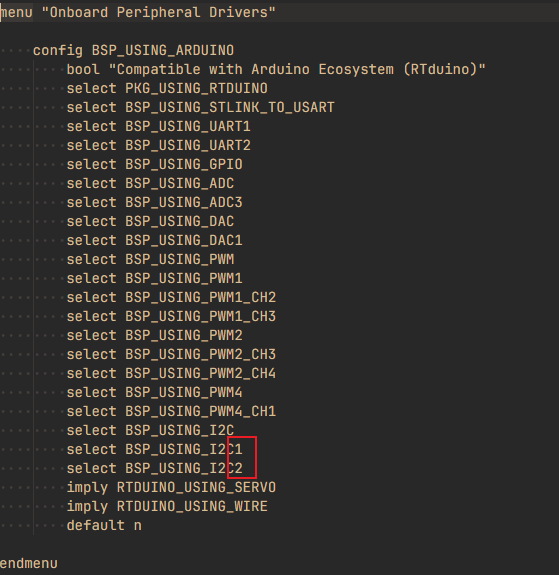
      
   2. 修改完成后是一下这个样子。

      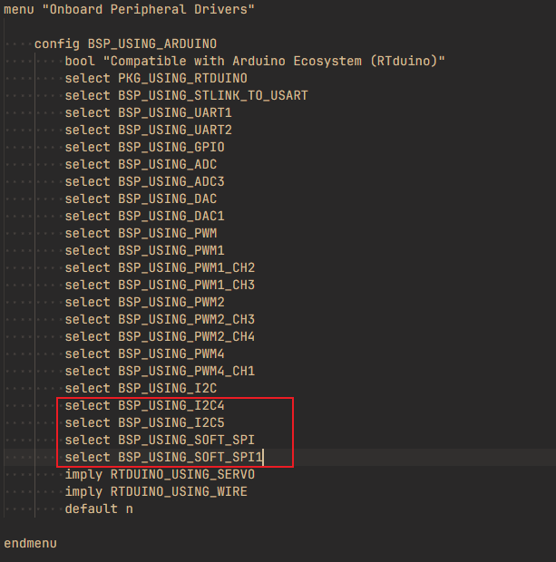

   3. 我们再修改`On-chip Peripheral Drivers`里的内容。`UART`、`GPIO`、`ADC`、`DAC`、`PWM`（检查定时器编号、通道号）这些一般不会有太大的问题。

      `I2C`需要检查引脚编号是否正确（计算方法：例如PG.n：`(G - A = 6)*16 + n`），**把编号改为4和5**，而且他只给我们生成一个`menuconfig BSP_USING_I2C1`，我们需要自己补充一下另外一个`menuconfig`。

      修改前：

      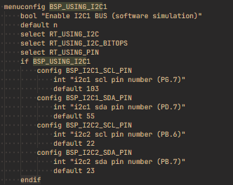

      修改后：

      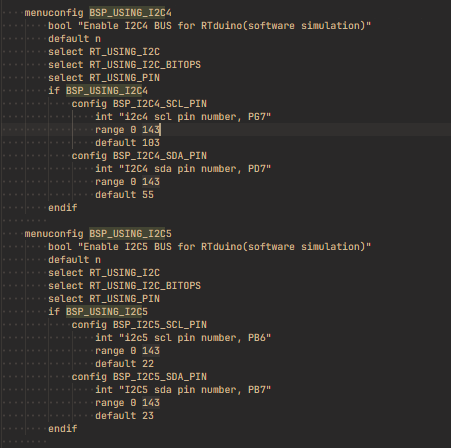

      然后我们`PG5-PG3-PG1`需要用到软件SPI，这里他没有生成给我们，我们自己去写一下：

      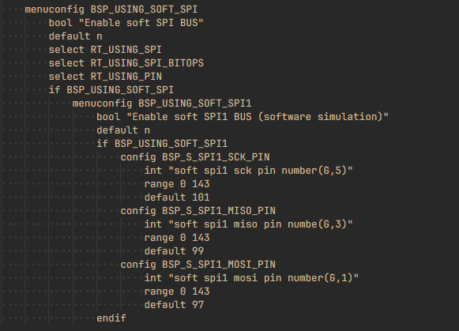

   4. 做完上面的修改工作以后我们就需要去把代码从`Kconfig.demo`复制到`stm32f407-rt-spark\board\Kconfig`里面。

      `Onboard Peripheral Drivers`的内容可以直接复制过去。
      
      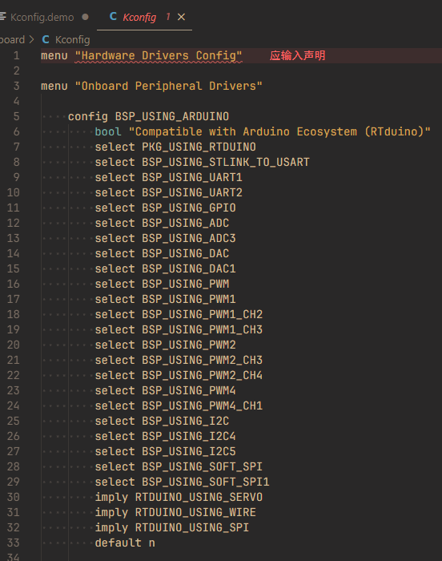
      
   5. 然后就是`On-chip Peripheral Drivers`里的，这个我们可以使用Ctrl+F查找功能，对比着两份代码，有些 config 是已经写好了的，我们就不需要重复定义。

      像这里，`BSP_USING_UART`本来已经有了，我们就不需要修改了，直接找下一个就好。
      
      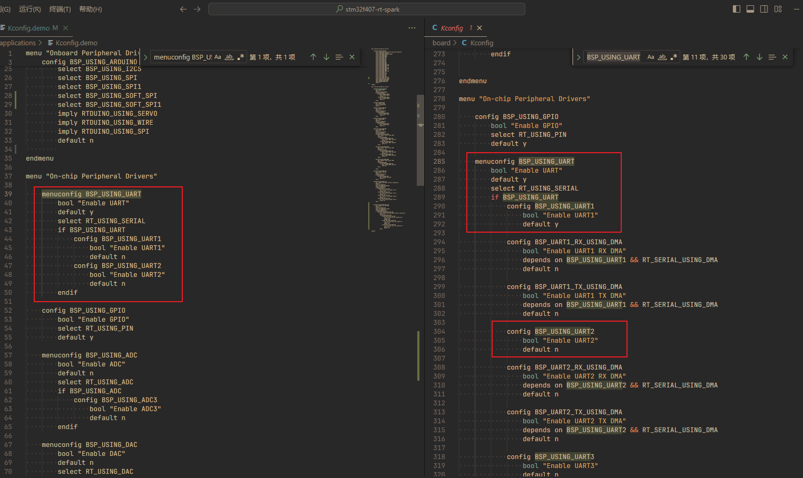
      
      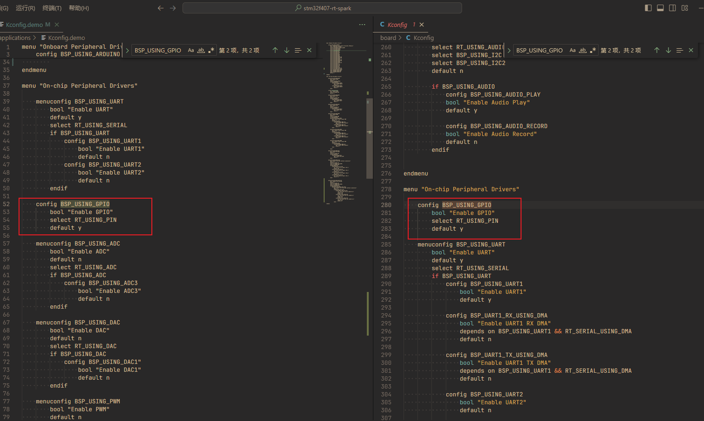
      
      我们慢慢寻找，前面大多数都会有定义，我们一个一个检查一下就好。
      
      然后在I2C处的时候会发现其中已经定义出了I2C1、I2C2、I2C3总线连接着不同的东西，作为新手，我们还没熟悉这块板子，不知道这几个哪个可以删除哪个需要保留，所以我们最好的方法就是把我们的总线在后面添加为I2C4、I2C5，这样子就既能保留住之前默认的配置，也能完成我们自己的。
      
      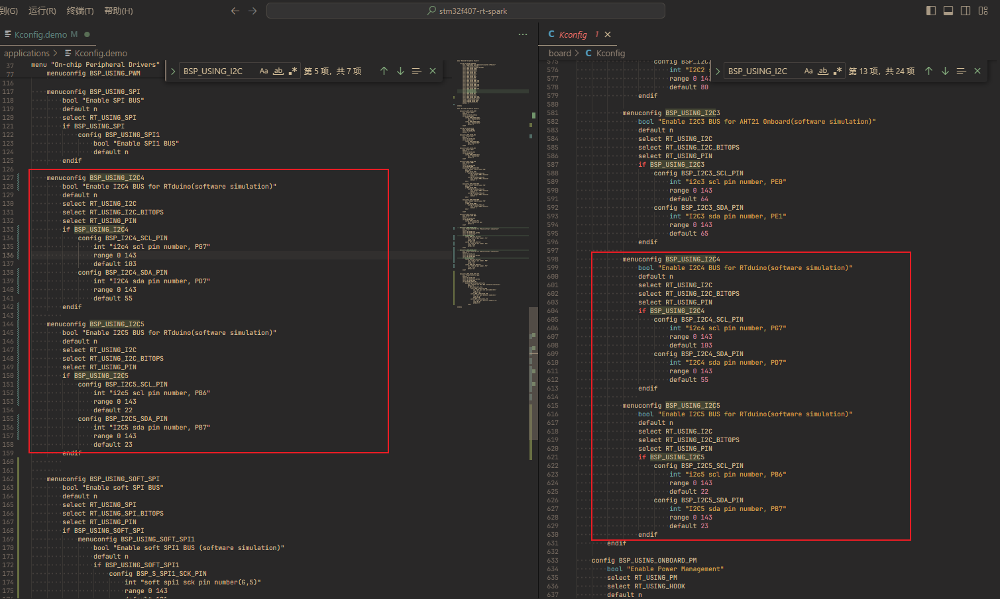
      
      到 软件SPI 这里，我们直接修改上面的`BSP_USING_SOFT_SPI1`上的引脚编号就好。这里不用在后面添加的原因是：在RTT中，I2C一般都是拿软件去模拟的，大多数 I2C 设备也是挂载在 软件I2C 总线上，但是对于SPI而言是用硬件驱动较多，我们是因为 PG5、PG3、PG1 没有硬件功能所以才拿软件模拟SPI，所以我们修改 SOFT_SPI1 上的引脚就好，不需要我们再去添加了。
      
      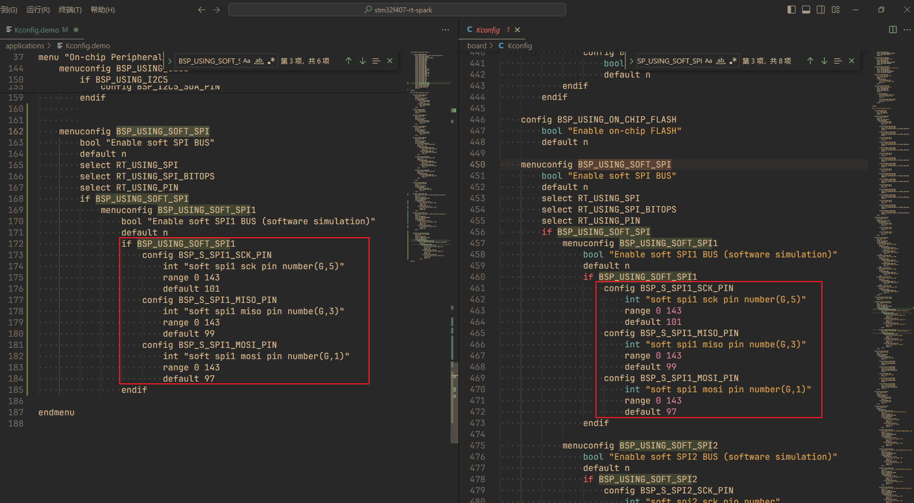

3. 完成这些工作以后我们就可以进入到`arduino_pinout`文件中，里面有.c跟.h文件。

   在.c文件中我们需要把i2c的编号修改为4和5，然后检查一下其它引脚是否跟规划的一致，还需要在PG5、PG3、PG1的后面添加上软件SPI的设备名字 `"sspi1"`。

   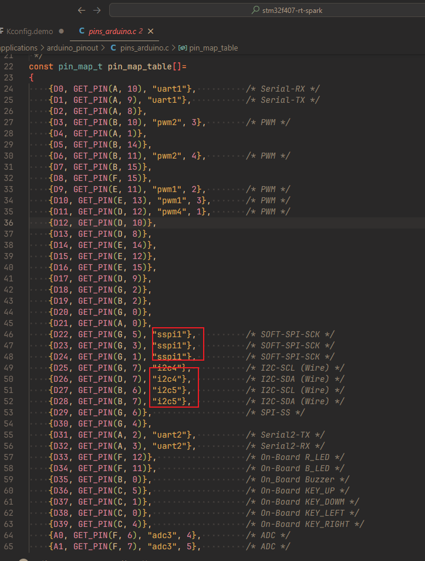

   在.h文件中，我们在这里可以设置默认的 I2C 为`i2c4`（你也可以设置为`i2c5`），默认的 SPI 为`sspi1`。

   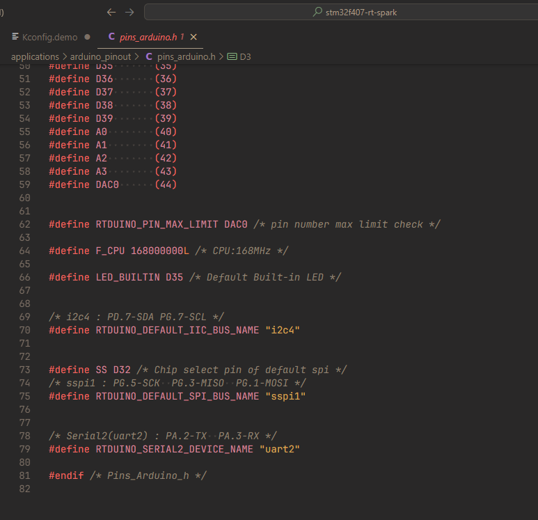

   

4. 都修改完成后我们还需要做一步，查看`rt-thread\bsp\stm32\libraries\HAL_Drivers\drivers\drv_soft_i2c.h`里的I2C驱动，会发现只给我们预留了四条软件I2C总线，等于说我们的自己的第五条I2C是还不能使用的。

   .h文件：

   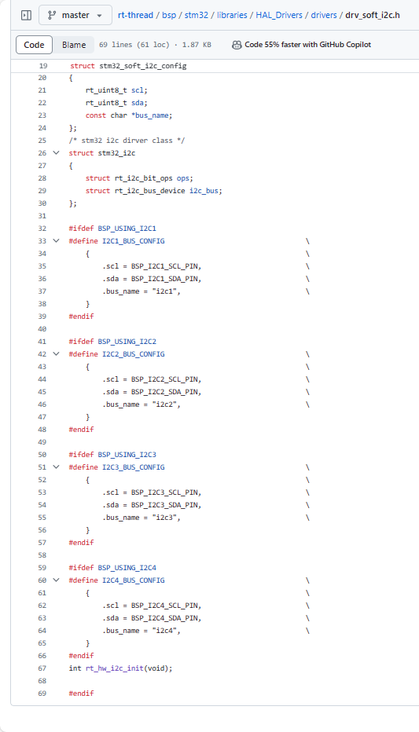

   .c文件：

   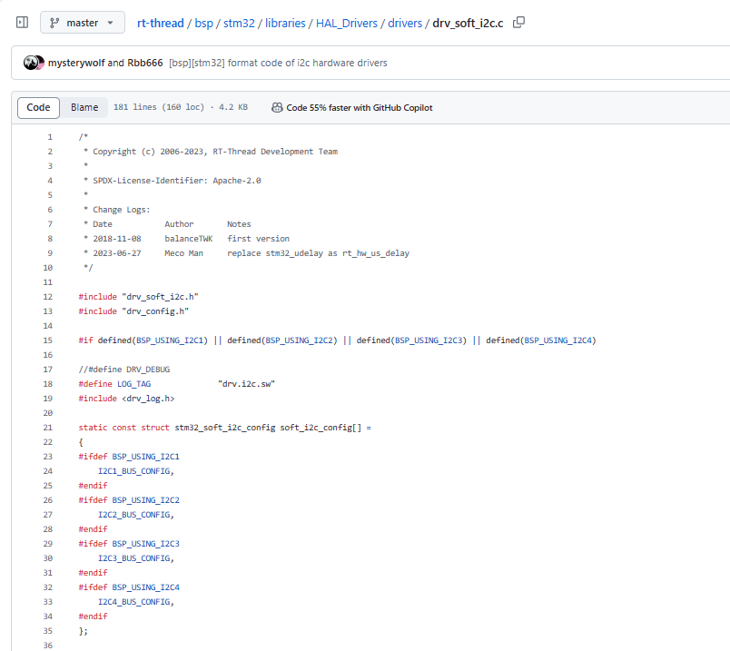

   需要自己按照格式手动去添加一下第五条总线就好啦。

   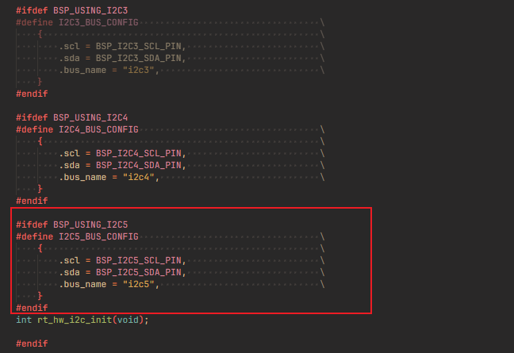

   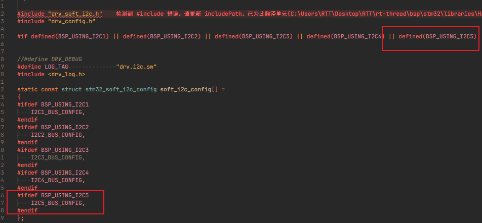

## 调试

完成上面配置以后，我们进入文件夹中打开ENV工具，输入`menuconfig`，进入到选择菜单界面，按照如图路径选择开启RTduino。如果你有兴趣的话，可以学习一下Kconfig语法查看一下刚刚所做的配置，这样会让你学习得更快。

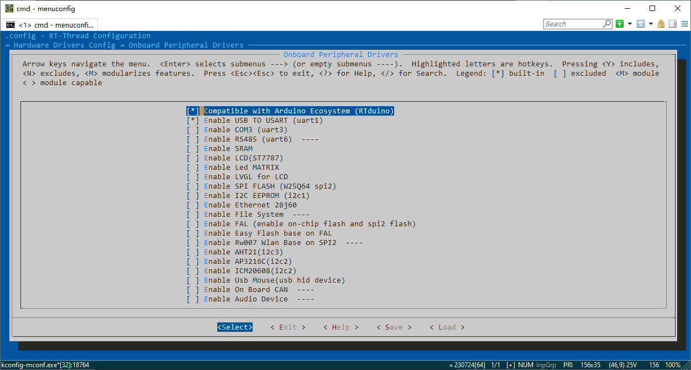

一直按ESC回退到ENV界面，记得退出的时候选择Yes保存当前配置，在调用`pkgs --update`指令（使用时关闭代理）把RTduino的软件包下载下来。使用`scons -j16`进行编译，如果没有问题，你就可以开始在RTduino大展身手了。

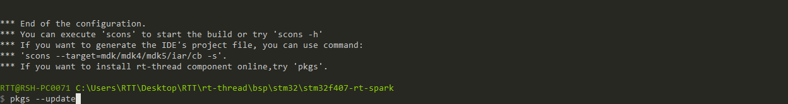

## 结语

本文主要介绍了如何在星火一号开发板上适配 RTduino，并且这个过程适用于多个开发板的配置。写者在教程中讨论了自己在配置过程中所遇到的各种问题和挑战，并提供了解决方法。希望这些经验可以帮助读者在配置自己的开发板时更加顺利地解决可能遇到的问题。
